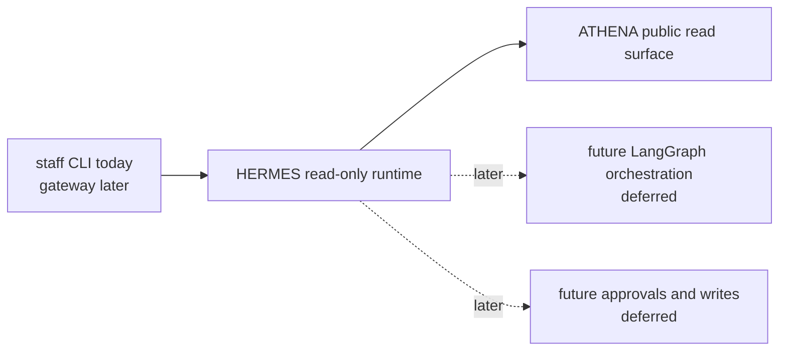

# hermes

HERMES is the staff-facing operations repo in ASHTON.

> Current real slice: one read-only staff CLI question,
> `hermes ask occupancy --facility <id>`, backed by ATHENA's public
> `GET /api/v1/presence/count?facility=` surface. This tracer proves that
> HERMES can read and summarize upstream truth without write authority,
> private DB access, or agent orchestration.

That is intentionally narrow. HERMES is no longer docs-first, but it is still
nowhere close to a broad assistant runtime. The value of this repo right now is
that the first staff slice is executable, source-backed, and easy to audit.

## Planned Architecture

The standalone Mermaid source for the long-range plan lives at
[`docs/diagrams/hermes-read-only-ops.mmd`](docs/diagrams/hermes-read-only-ops.mmd).

## Runtime Surfaces

| Surface | Path / Command | Status | Notes |
| --- | --- | --- | --- |
| Occupancy CLI | `hermes ask occupancy --facility <id> [--athena-base-url ...] [--format json|text]` | Real | Read-only staff query backed by ATHENA HTTP |
| Version CLI | `hermes version` | Real | Prints the current build version |
| Go runtime bootstrap | `go run ./cmd/hermes` | Real | Starts the Cobra CLI |
| Gateway | - | Planned | Not part of the current tracer |
| Agent orchestration | - | Planned | Deferred until the read-only boundary is trusted |
| Write actions | - | Deferred | No booking, maintenance, or approvals exist in runtime |

## Current Delivery State

| Area | Status | Notes |
| --- | --- | --- |
| Read-only staff boundary | Real | HERMES now answers one bounded staff question without write authority |
| ATHENA client | Real | Uses ATHENA's public occupancy endpoint instead of private data access |
| Structured result shape | Real | Returns `facility_id`, `current_count`, `observed_at`, and `source_service` |
| Error handling | Real | Missing input, malformed upstream data, timeouts, and upstream 500s fail clearly |
| Gateway, agent, approvals | Deferred | Still intentionally out of scope |

## Technology And Delivery Plan

| Layer | Technology / Pattern | Status | Why |
| --- | --- | --- | --- |
| Documentation spine | Markdown READMEs, roadmap, runbook, growing pains | Instituted | Keeps the repo honest about what is real |
| CLI runtime | Go + Cobra | Real | Smallest executable staff surface for the first tracer |
| ATHENA client | Go `net/http` + explicit JSON parsing | Real | Reads stable public upstream truth without private schema drift |
| Structured read output | JSON or text | Real | Keeps the first answer traceable and machine-checkable |
| Interactive gateway | Go | Planned | Future staff session entrypoint, not current runtime |
| Agent orchestration | LangGraph (Python) | Planned | Deferred until read-only trust is earned |
| Write safety | Human-in-the-loop approvals | Planned | No write behavior exists yet |
| Broad write surface | Booking, maintenance, or audit mutations | Deferred | This tracer is read-only by design |

## Staff Boundary

| HERMES Should Do | HERMES Should Not Do |
| --- | --- |
| answer one bounded staff ops question with real upstream data | own physical-truth or member-truth data |
| identify the source service used for the answer | bypass service boundaries with private DB access |
| fail clearly when the source service is unavailable or malformed | fabricate fallback answers |
| stay read-only in the first tracer | expose bookings, maintenance, or approval writes |

## First Real Slice

The chosen Tracer 8 question is:

- "What is the current occupancy at facility X right now?"

That is intentionally narrower than "who is in the facility right now." The
public ATHENA read surface exposes facility occupancy, not member identity, so
HERMES does not invent a richer answer than the source can support.

The current output shape is:

- `facility_id`
- `current_count`
- `observed_at`
- `source_service`
- optional `notes`

## Current Real Slice

- `hermes ask occupancy --facility ashtonbee` is real
- the command reads only from ATHENA's public
  `GET /api/v1/presence/count?facility=` surface
- the command is ownerless and staff-facing; there is no student or member
  write path in this tracer
- unknown facilities remain source-backed and resolve to `current_count = 0`
  if ATHENA says so
- timeouts, malformed JSON, and upstream 500s return explicit errors instead of
  fabricated answers
- the slice is locally proven only; no live deployment claim was added

## Planned Component Map

| Component | Responsibility | State |
| --- | --- | --- |
| `cmd/hermes/` | CLI entrypoint | Real |
| `internal/command/` | Cobra command wiring and output formatting | Real |
| `internal/athena/` | ATHENA occupancy client | Real |
| `internal/ops/` | Read-only occupancy answer service | Real |
| `internal/config/` | CLI and environment config validation | Real |
| gateway / agent / approvals | broader staff runtime | Planned |

## Deployment Boundary

Tracer 8 does not widen deployment truth.

- verified local truth: HERMES can answer one read-only occupancy question from
  a real ATHENA runtime
- verified deployed truth: unchanged from earlier milestones
- deferred cluster truth: no live HERMES deployment claim exists yet

## Docs Map

- [Planned HERMES diagram](docs/diagrams/hermes-read-only-ops.mmd)
- [Roadmap](docs/roadmap.md)
- [Growing pains](docs/growing-pains.md)
- [Read-only ops runbook](docs/runbooks/read-only-ops.md)
- [ADR index](docs/adr/README.md)
- [Canonical repo brief](../ashton-platform/planning/repo-briefs/hermes.md)

## Why HERMES Matters

HERMES now proves the first staff-facing read path in ASHTON. That matters less
because the question is big and more because the boundary is clean: one bounded
operational question, one public upstream read surface, zero write authority,
and no invented truth.
