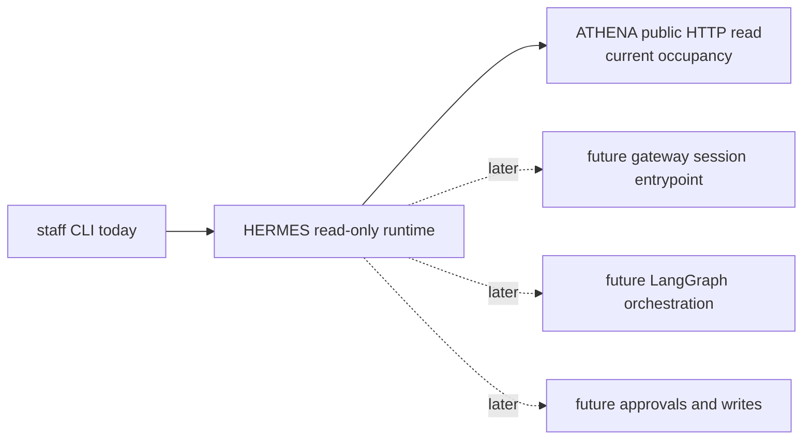

# hermes

HERMES is the staff-facing operations repo in ASHTON.

> Current real slice: two bounded read-only staff CLI questions,
> `hermes ask occupancy --facility <id>` and
> `hermes ask reconciliation --facility <id> --window <duration> --bin <duration>`.
> The richer reconciliation answer reads ATHENA's current occupancy plus one
> bounded privacy-safe stable-history surface and returns an occupancy report
> plus heat-map-style buckets without write authority, private DB access, or
> agent orchestration. Milestone 1.7 deployment proof still applies only to the
> original occupancy slice.

That is intentionally narrow. HERMES is no longer docs-first, but it is still
nowhere close to a broad assistant runtime. The value of this repo right now is
that the first staff slice is executable, source-backed, and easy to audit in
both local and deployed form.

Packaging note: the repo now includes a container build path at
[`Dockerfile`](Dockerfile) so the same bounded runtime can be packaged for
internal deployment. That is build and packaging truth, not a broader runtime
capability.

Representative command:

```bash
hermes ask reconciliation --facility ashtonbee --window 24h --bin 1h --format json
```

Representative response:

```json
{
  "facility_id": "ashtonbee",
  "source_service": "athena",
  "window_start": "2026-04-08T13:00:00Z",
  "window_end": "2026-04-09T13:00:00Z",
  "current": {
    "current_count": 42,
    "observed_at": "2026-04-09T13:00:00Z"
  },
  "report": {
    "opening_count": 38,
    "net_change": 4,
    "committed_entries": 19,
    "committed_exits": 15,
    "failed_observations": 3,
    "observed_pass_without_change": 2,
    "peak_occupancy": 47,
    "peak_observed_at": "2026-04-09T11:10:00Z"
  }
}
```

## Current And Future Architecture

The standalone Mermaid source for the current and future view lives at
[`docs/diagrams/hermes-read-only-ops.mmd`](docs/diagrams/hermes-read-only-ops.mmd).



## Runtime Surfaces

| Surface | Path / Command | Status | Notes |
| --- | --- | --- | --- |
| Occupancy CLI | `hermes ask occupancy --facility <id> [--athena-base-url ...] [--format json|text]` | Real | Read-only staff query backed by ATHENA HTTP |
| Reconciliation CLI | `hermes ask reconciliation --facility <id> --window <duration> --bin <duration> [--athena-base-url ...] [--format json|text]` | Real | Read-only staff reconciliation question backed by ATHENA current occupancy plus bounded stable-history HTTP |
| Version CLI | `hermes version` | Real | Prints the injected build version, or `dev` for local source builds |
| Go runtime bootstrap | `go run ./cmd/hermes` | Real | Starts the Cobra CLI |
| Gateway | - | Planned | Not part of the current tracer |
| Agent orchestration | - | Planned | Deferred until the read-only boundary is trusted |
| Write actions | - | Deferred | No booking, maintenance, or approvals exist in runtime |

## Current Delivery State

| Area | Status | Notes |
| --- | --- | --- |
| Read-only staff boundary | Real | HERMES now answers one thin occupancy question plus one richer reconciliation question without write authority |
| ATHENA client | Real | Uses ATHENA's public occupancy endpoint plus one bounded privacy-safe history endpoint instead of private data access |
| Structured result shape | Real | Returns source-backed occupancy and reconciliation payloads in JSON or text |
| Structured observability | Real | Emits one request-start and one request-complete or request-failed log line per occupancy or reconciliation request on stderr only |
| Error handling | Real | Missing input, malformed upstream data, invalid history windows, timeouts, and upstream failures all fail clearly |
| Gateway, agent, approvals | Deferred | Still intentionally out of scope |

## Technology And Delivery Plan

| Layer | Technology / Pattern | Status | Line | Why |
| --- | --- | --- | --- | --- |
| Documentation spine | Markdown READMEs, roadmap, runbook, growing pains | Instituted | `v0.0.1` -> `v0.1.0` | Keeps the repo honest about what is real |
| CLI runtime | Go + Cobra | Real | `v0.1.0` | Smallest executable staff surface for the first tracer |
| ATHENA client | Go `net/http` + explicit JSON parsing | Real | `v0.1.0` | Reads stable public upstream truth without private schema drift |
| Structured read output | JSON or text | Real | `v0.1.0` | Keeps the first answer traceable and machine-checkable |
| Observability hardening | low-noise structured request/result logs | Real | `v0.1.1` | Tracer 14 makes the current occupancy slice operationally inspectable without widening it |
| Stable-history reconciliation read | bounded occupancy report plus heat-map-style buckets | Real | `v0.2.0` | Tracer 17 widens HERMES with one richer read-only operator question over ATHENA durable-history truth |
| Live deployment proof | deployed HERMES runtime | Real | deployment-only closeout | Milestone 1.7 proved the existing slice live without widening the question |
| Interactive gateway | Go | Planned | later than `v0.2.0` | Future staff session entrypoint, not current runtime |
| Agent orchestration | LangGraph (Python) | Planned | later than `v0.3.0` | Deferred until read-only trust is earned |
| Write safety | Human-in-the-loop approvals | Planned | `v0.3.0` | No write behavior exists yet |
| Broad write surface | Booking, maintenance, or audit mutations | Deferred | later than `v0.3.0` | This tracer is read-only by design |

## Staff Boundary

| HERMES Should Do | HERMES Should Not Do |
| --- | --- |
| answer one bounded staff ops question and one richer reconciliation question with real upstream data | own physical-truth or member-truth data |
| identify the source service used for the answer | bypass service boundaries with private DB access |
| fail clearly when the source service is unavailable or malformed | fabricate fallback answers |
| stay read-only in the current tracer | expose bookings, maintenance, or approval writes |

## First Real Slice

The chosen Tracer 8 question is:

- "What is the current occupancy at facility X right now?"

That is intentionally narrower than "who is in the facility right now." The
public ATHENA read surface exposes facility occupancy, not member identity, so
HERMES does not invent a richer answer than the source can support.

The current output shape is:

- `facility_id`
- `current_count`
- `observed_at`
- `source_service`
- optional `notes`

## Current Real Slice

- `hermes ask occupancy --facility ashtonbee` is real
- `hermes ask reconciliation --facility ashtonbee --window 24h --bin 1h` is real
- the command reads only from ATHENA's public
  `GET /api/v1/presence/count?facility=` surface
- the richer reconciliation command also reads one bounded ATHENA stable-history
  surface:
  `GET /api/v1/presence/history?facility=<id>&since=<rfc3339>&until=<rfc3339>`
- the command is ownerless and staff-facing; there is no student or member
  write path in this tracer
- unknown facilities remain source-backed and resolve to `current_count = 0`
  if ATHENA says so
- reconciliation output stays privacy-safe: no raw account values, resolved
  names, or hashed identities are printed
- occupancy reports and heat-map-style buckets are deterministic for the same
  upstream inputs
- each occupancy request now emits one structured `request-start` line and one
  structured `request-complete` or `request-failed` line on stderr only, so
  stdout answer payloads stay unchanged
- each reconciliation request follows the same low-noise stderr logging shape
  with `question = "reconciliation"` and `tracer = 17`
- timeouts, malformed JSON, and upstream 500s return explicit errors instead of
  fabricated answers
- the richer reconciliation slice is proven locally/runtime only
- the deployed shape remains internal-only and exec-driven, and deployed truth
  is still the earlier occupancy-only runner slice

## Planned Component Map

| Component | Responsibility | State |
| --- | --- | --- |
| `cmd/hermes/` | CLI entrypoint | Real |
| `internal/command/` | Cobra command wiring and output formatting | Real |
| `internal/athena/` | ATHENA occupancy and stable-history client | Real |
| `internal/ops/` | Read-only occupancy and reconciliation answer services | Real |
| `internal/config/` | CLI and environment config validation | Real |
| gateway / agent / approvals | broader staff runtime | Planned |

## Deployment Boundary

Tracer 8 did not widen deployment truth; Milestone 1.7 closed it as a bounded
internal runner deployment.

- verified local truth: HERMES can answer one read-only occupancy question from
  a real ATHENA runtime, and one richer reconciliation question from stable
  ATHENA current + history truth
- verified deployed truth: HERMES answers the occupancy question in cluster as
  an internal-only runner deployment; Tracer 17 does not add deployed proof
- deferred truth: no public service, write authority, or broader assistant
  surface was added, and reconciliation deployment proof remains deferred

## Hardening Notes

Tracer 8 hardening intentionally exercised both successful and failing paths.
The failing paths are part of the proof, not evidence that the happy path is
broken.

Expected destructive failures during hardening:

- missing `--facility` fails clearly before any upstream call
- invalid `--window` / `--bin` combinations fail clearly before a successful
  answer is printed
- invalid `--timeout` fails clearly during config validation
- unavailable upstream fails clearly with a non-zero exit
- malformed current or history upstream JSON fails clearly instead of
  fabricating a fallback answer

Accepted non-blocking carry-forward gaps:

- no write or approval boundary exists yet
- no reconciliation deployment proof is required for the current line

`Milestone 1.7` already closed as deployment-only truth on the earlier
occupancy slice. Now that `v0.2.0` is shipped, any runtime-safe follow-up on
the current read-only surface should remain a patch-style `v0.2.x`, not a new
capability minor.

Prometheus remained out of scope for Tracer 8 hardening because deployment
truth did not change.

## Release History

| Release line | Exact tags | Status | What became real | What stayed deferred |
| --- | --- | --- | --- | --- |
| `v0.0.1` | `v0.0.1` | Shipped | docs-first planning baseline | executable runtime, deployment proof, and write actions |
| `v0.1.0` | `v0.1.0` | Shipped | read-only occupancy CLI over ATHENA public truth | observability hardening, live deployment proof, richer questions, and write actions |
| `v0.1.1` | `v0.1.1` | Shipped | low-noise structured occupancy request/result/outcome observability without runtime widening | live deployment proof, richer questions, and write actions |
| `v0.2.0` | `v0.2.0` | Shipped | one richer read-only reconciliation question plus occupancy reports and heat-map-style buckets over stable ATHENA truth | writes, overrides, identity-level reconciliation answers, and reconciliation deployment proof |

## Versioning Discipline

HERMES now follows formal pre-`1.0.0` semantic versioning rather than loose
"semver-lite" wording.

- `PATCH` releases are for observability, hardening, documentation, deployment
  closeout, and bounded non-widening fixes
- `MINOR` releases are for new bounded read capabilities, new write
  capabilities, or intentional pre-`1.0.0` boundary changes
- pre-`1.0.0` breaking changes still require a `MINOR`, never a `PATCH`
- `1.0.0` is reserved for a stable operator contract with trusted deployment,
  legible docs, and durable boundary expectations

## Planned Release Lines

| Planned tag | Intended purpose | Restrictions | What it should not do yet |
| --- | --- | --- | --- |
| `v0.2.1` | reserved for a future bounded hardening follow-up on the current occupancy + reconciliation surface | keep the runtime read-only, source-backed, and within the current two-question CLI shape | do not add a second richer question, write authority, or broad assistant UX |
| `v0.3.0` | first write action plus approval boundary | add explicit write authority only with approval discipline | do not widen into broad workflow orchestration in the same line |

## Next Ladder Role

| Line | Role | Why it matters |
| --- | --- | --- |
| `v0.2.0` / `Tracer 17` | one richer read-only reconciliation question | creates the first broader operator-facing read surface without widening into overrides or writes |
| `v0.2.1` | bounded hardening follow-up if the current read-only surface needs it | keeps the current line honest without creating a second capability jump |
| `v0.3.0` | first write action plus approval boundary | moves HERMES past read-only only when explicit approval discipline exists |

## Docs Map

- [Current and future HERMES diagram](docs/diagrams/hermes-read-only-ops.mmd)
- [Roadmap](docs/roadmap.md)
- [Growing pains](docs/growing-pains.md)
- [Tracer 8 hardening](docs/hardening/tracer-8.md)
- [Tracer 14 hardening](docs/hardening/tracer-14.md)
- [Tracer 17 hardening](docs/hardening/tracer-17.md)
- [Read-only ops runbook](docs/runbooks/read-only-ops.md)
- [ADR index](docs/adr/README.md)
- [Canonical repo brief](../ashton-platform/planning/repo-briefs/hermes.md)

## Why HERMES Matters

HERMES now proves the first staff-facing read paths in ASHTON. That matters
less because the questions are flashy and more because the boundary is clean:
one thin occupancy read, one richer reconciliation read over stable history,
bounded public upstream surfaces, zero write authority, and no invented truth.
