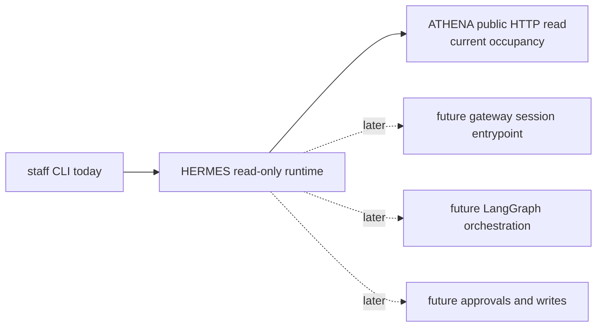

# hermes

HERMES is the staff-facing operations repo in ASHTON.

> Current real slice: one read-only staff CLI question,
> `hermes ask occupancy --facility <id>`, backed by ATHENA's public
> `GET /api/v1/presence/count?facility=` surface. This tracer proves that
> HERMES can read and summarize upstream truth without write authority,
> private DB access, or agent orchestration.

That is intentionally narrow. HERMES is no longer docs-first, but it is still
nowhere close to a broad assistant runtime. The value of this repo right now is
that the first staff slice is executable, source-backed, and easy to audit.

Representative command:

```bash
hermes ask occupancy --facility ashtonbee --format json
```

Representative response:

```json
{
  "facility_id": "ashtonbee",
  "current_count": 42,
  "observed_at": "2026-04-04T12:00:00Z",
  "source_service": "athena"
}
```

## Current And Future Architecture

The standalone Mermaid source for the current and future view lives at
[`docs/diagrams/hermes-read-only-ops.mmd`](docs/diagrams/hermes-read-only-ops.mmd).



## Runtime Surfaces

| Surface | Path / Command | Status | Notes |
| --- | --- | --- | --- |
| Occupancy CLI | `hermes ask occupancy --facility <id> [--athena-base-url ...] [--format json|text]` | Real | Read-only staff query backed by ATHENA HTTP |
| Version CLI | `hermes version` | Real | Prints the current build version |
| Go runtime bootstrap | `go run ./cmd/hermes` | Real | Starts the Cobra CLI |
| Gateway | - | Planned | Not part of the current tracer |
| Agent orchestration | - | Planned | Deferred until the read-only boundary is trusted |
| Write actions | - | Deferred | No booking, maintenance, or approvals exist in runtime |

## Current Delivery State

| Area | Status | Notes |
| --- | --- | --- |
| Read-only staff boundary | Real | HERMES now answers one bounded staff question without write authority |
| ATHENA client | Real | Uses ATHENA's public occupancy endpoint instead of private data access |
| Structured result shape | Real | Returns `facility_id`, `current_count`, `observed_at`, and `source_service` |
| Error handling | Real | Missing input, malformed upstream data, timeouts, and upstream 500s fail clearly |
| Gateway, agent, approvals | Deferred | Still intentionally out of scope |

## Technology And Delivery Plan

| Layer | Technology / Pattern | Status | Line | Why |
| --- | --- | --- | --- | --- |
| Documentation spine | Markdown READMEs, roadmap, runbook, growing pains | Instituted | `v0.0.1` -> `v0.1.0` | Keeps the repo honest about what is real |
| CLI runtime | Go + Cobra | Real | `v0.1.0` | Smallest executable staff surface for the first tracer |
| ATHENA client | Go `net/http` + explicit JSON parsing | Real | `v0.1.0` | Reads stable public upstream truth without private schema drift |
| Structured read output | JSON or text | Real | `v0.1.0` | Keeps the first answer traceable and machine-checkable |
| Observability hardening | low-noise structured request/result logs | Planned | `v0.1.1` | Tracer 14 should strengthen operational maturity before widening scope |
| Live deployment proof | containerized HERMES runtime | Planned | `v0.2.0` | Milestone 1.7 should prove the existing slice live without widening the question |
| Interactive gateway | Go | Planned | later than `v0.2.0` | Future staff session entrypoint, not current runtime |
| Agent orchestration | LangGraph (Python) | Planned | later than `v0.3.0` | Deferred until read-only trust is earned |
| Write safety | Human-in-the-loop approvals | Planned | `v0.4.0` | No write behavior exists yet |
| Broad write surface | Booking, maintenance, or audit mutations | Deferred | later than `v0.4.0` | This tracer is read-only by design |

## Staff Boundary

| HERMES Should Do | HERMES Should Not Do |
| --- | --- |
| answer one bounded staff ops question with real upstream data | own physical-truth or member-truth data |
| identify the source service used for the answer | bypass service boundaries with private DB access |
| fail clearly when the source service is unavailable or malformed | fabricate fallback answers |
| stay read-only in the first tracer | expose bookings, maintenance, or approval writes |

## First Real Slice

The chosen Tracer 8 question is:

- "What is the current occupancy at facility X right now?"

That is intentionally narrower than "who is in the facility right now." The
public ATHENA read surface exposes facility occupancy, not member identity, so
HERMES does not invent a richer answer than the source can support.

The current output shape is:

- `facility_id`
- `current_count`
- `observed_at`
- `source_service`
- optional `notes`

## Current Real Slice

- `hermes ask occupancy --facility ashtonbee` is real
- the command reads only from ATHENA's public
  `GET /api/v1/presence/count?facility=` surface
- the command is ownerless and staff-facing; there is no student or member
  write path in this tracer
- unknown facilities remain source-backed and resolve to `current_count = 0`
  if ATHENA says so
- timeouts, malformed JSON, and upstream 500s return explicit errors instead of
  fabricated answers
- the slice is locally proven only; no live deployment claim was added

## Planned Component Map

| Component | Responsibility | State |
| --- | --- | --- |
| `cmd/hermes/` | CLI entrypoint | Real |
| `internal/command/` | Cobra command wiring and output formatting | Real |
| `internal/athena/` | ATHENA occupancy client | Real |
| `internal/ops/` | Read-only occupancy answer service | Real |
| `internal/config/` | CLI and environment config validation | Real |
| gateway / agent / approvals | broader staff runtime | Planned |

## Deployment Boundary

Tracer 8 does not widen deployment truth.

- verified local truth: HERMES can answer one read-only occupancy question from
  a real ATHENA runtime
- verified deployed truth: unchanged from earlier milestones
- deferred cluster truth: no live HERMES deployment claim exists yet

## Hardening Notes

Tracer 8 hardening intentionally exercised both successful and failing paths.
The failing paths are part of the proof, not evidence that the happy path is
broken.

Expected destructive failures during hardening:

- missing `--facility` fails clearly before any upstream call
- invalid `--timeout` fails clearly during config validation
- unavailable upstream fails clearly with a non-zero exit
- malformed upstream JSON fails clearly instead of fabricating a fallback answer

Accepted non-blocking carry-forward gaps:

- HERMES success-path observability is still thin; runtime inspection relies
  primarily on CLI output and upstream behavior rather than dedicated HERMES
  request/result logs
- no live HERMES deployment proof exists yet
- no richer staff questions beyond occupancy are proven yet

Prometheus remained out of scope for Tracer 8 hardening because deployment
truth did not change.

## Release History

| Release line | Exact tags | Status | What became real | What stayed deferred |
| --- | --- | --- | --- | --- |
| `v0.0.1` | `v0.0.1` | Shipped | docs-first planning baseline | executable runtime, deployment proof, and write actions |
| `v0.1.0` | `v0.1.0` | Shipped | read-only occupancy CLI over ATHENA public truth | observability hardening, live deployment proof, richer questions, and write actions |

## Planned Release Lines

| Planned tag | Intended purpose | Restrictions | What it should not do yet |
| --- | --- | --- | --- |
| `v0.1.1` | observability hardening for Tracer 14 | keep the surface read-only and occupancy-only | do not widen into richer staff questions or writes |
| `v0.2.0` | live deployment proof for Milestone 1.7 | prove the existing occupancy slice in-cluster and stop there | do not imply write authority or broad assistant maturity |
| `v0.3.0` | one richer read-only staff question if public upstream truth supports it | keep the new question source-backed and narrow | do not invent identity-level answers without public upstream truth |
| `v0.4.0` | first write action plus approval boundary | add explicit write authority only with approval discipline | do not widen into broad workflow orchestration in the same line |

## Docs Map

- [Current and future HERMES diagram](docs/diagrams/hermes-read-only-ops.mmd)
- [Roadmap](docs/roadmap.md)
- [Growing pains](docs/growing-pains.md)
- [Tracer 8 hardening](docs/hardening/tracer-8.md)
- [Read-only ops runbook](docs/runbooks/read-only-ops.md)
- [ADR index](docs/adr/README.md)
- [Canonical repo brief](../ashton-platform/planning/repo-briefs/hermes.md)

## Why HERMES Matters

HERMES now proves the first staff-facing read path in ASHTON. That matters less
because the question is big and more because the boundary is clean: one bounded
operational question, one public upstream read surface, zero write authority,
and no invented truth.
