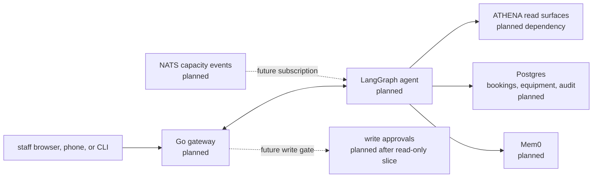

# hermes

HERMES is the planned staff-facing operations assistant for the ASHTON
platform. It sits on top of ATHENA's physical-truth surfaces and is meant to
become the read-first, approval-gated conversational layer for facility staff.

> Current state: docs-first. The repo has roadmap, runbook, ADR index, and
> growing-pains notes, but no Go gateway, Python agent, bridge code, or service
> runtime has been authored yet.

That is not a weakness if it is documented honestly. This README is setting the
repo up for future expansion without pretending that the planned system already
exists.

## Planned Architecture

The standalone Mermaid source for this plan lives at
[`docs/diagrams/hermes-read-only-ops.mmd`](docs/diagrams/hermes-read-only-ops.mmd).

## Current Delivery State

| Area | Status | Notes |
| --- | --- | --- |
| README, roadmap, runbook, and growing-pains log | Instituted | The repo already has the first documentation spine |
| Staff-only boundary | Instituted in docs | HERMES is explicitly not the student-facing product surface |
| Go gateway runtime | Not started | Planned first executable layer |
| LangGraph/Python agent | Not started | Planned after the gateway shape is clear |
| Read-only ATHENA query path | Not started | This is the first tracer target |
| Write actions and approvals | Not started | Deliberately deferred behind approval design |

## Technology And Delivery Plan

| Layer | Technology / Pattern | Status | Why |
| --- | --- | --- | --- |
| Documentation spine | Markdown READMEs, roadmap, runbook, growing pains | Instituted | Gives the repo a stable planning and narrative base |
| Interactive gateway | Go | Planned | Keeps service patterns aligned with the rest of ASHTON |
| Agent orchestration | LangGraph (Python) | Planned | Fits the existing long-range ASHTON agent model |
| Go/Python bridge | gRPC streaming | Planned | Clear typed boundary between gateway and agent runtime |
| LLM backend | vLLM via Prometheus infrastructure | Planned | HERMES should consume platform capabilities, not redefine them |
| Staff memory | Mem0 | Planned | Useful later for cross-session operational context |
| Operational database | Postgres | Planned | Bookings, maintenance, equipment, and audit data belong here |
| Event subscription | NATS | Planned | Future capacity alerts and reactive notifications |
| Staff identity | Tailscale WhoIs | Planned | Keeps staff auth friction low inside the private mesh |
| Write safety | Human-in-the-loop approvals | Planned | Write actions should arrive only after read-only trust is earned |
| Broad write surface | Any real booking or maintenance mutations | Deferred | Read-only trust comes first |

## Staff Boundary

| HERMES Should Do | HERMES Should Not Do |
| --- | --- |
| answer staff questions with real ATHENA-backed context | become the member-facing product |
| surface operational data in natural language | own student social or matchmaking state |
| later coordinate booking, maintenance, and approvals | bypass approval on real write actions |
| later react to capacity conditions | redefine physical-truth logic that belongs in ATHENA |

## First Real Slice

| In Scope | Out Of Scope |
| --- | --- |
| one staff-facing question answered with real ATHENA data | real booking writes |
| a traceable read path from prompt to tool result | broad multi-tool agent orchestration |
| clear approval model for future writes | pretending approvals are implemented before the read path exists |
| observability and debugging discipline | member-facing flows |

The first useful HERMES tracer is not "build the whole ops bot." It is "prove
one read-only staff interaction cleanly and make the path easy to trust."

## Planned Component Map

| Planned Component | Responsibility | State |
| --- | --- | --- |
| Go gateway | WebSocket and REST entrypoint for staff sessions | Planned |
| Agent runtime | Tool-calling orchestration and response generation | Planned |
| ATHENA client layer | Read occupancy and facility state | Planned |
| Booking service | Later room and resource booking logic | Planned |
| Maintenance service | Later issue tracking and equipment workflows | Planned |
| Audit trail | Track staff and agent actions | Planned |
| Notification path | Later push or alert fan-out | Planned |

## Expansion Path

| Phase | Goal |
| --- | --- |
| Phase 1 | Read-only staff question over real ATHENA data |
| Phase 2 | Durable gateway and agent boundary with traceable tool calls |
| Phase 3 | Approval-gated write actions such as booking or maintenance filing |
| Phase 4 | Reactive subscriptions and richer operational workflows |

## Docs Map

- [Planned HERMES diagram](docs/diagrams/hermes-read-only-ops.mmd)
- [Roadmap](docs/roadmap.md)
- [Growing pains](docs/growing-pains.md)
- [Read-only ops runbook](docs/runbooks/read-only-ops.md)
- [ADR index](docs/adr/README.md)
- [Canonical repo brief](../ashton-platform/planning/repo-briefs/hermes.md)

## Why HERMES Matters

Documented honestly, HERMES already tells a useful story: the platform is not
just collecting data, it is being shaped into a staff-operable system with
explicit safety boundaries. The repo now has a structure that makes future
implementation easier to trust instead of harder to untangle.
